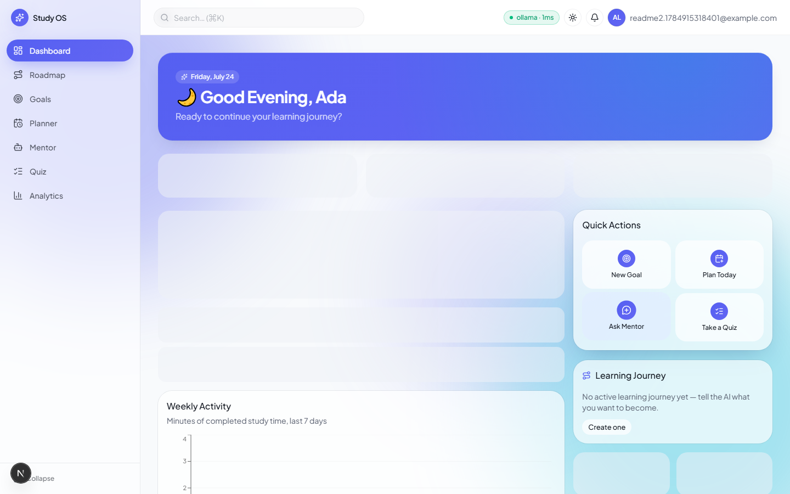
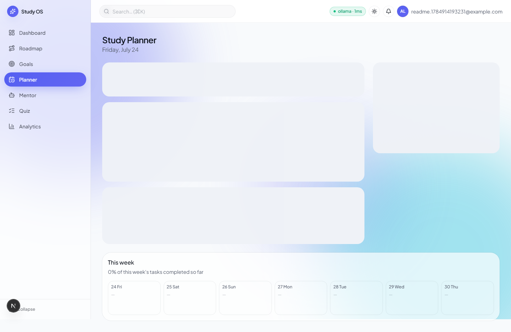
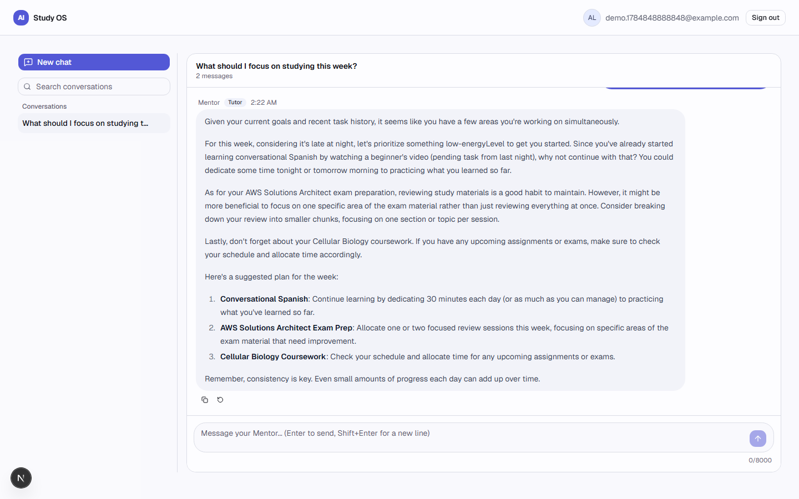
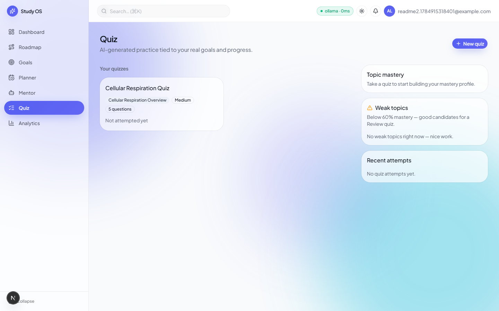
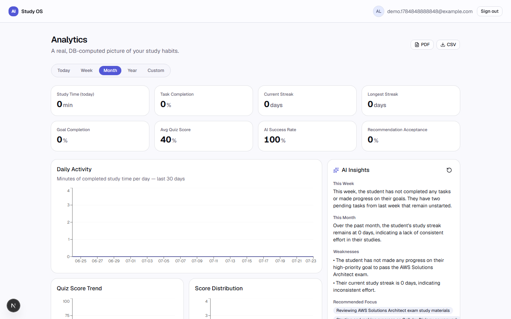
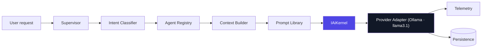
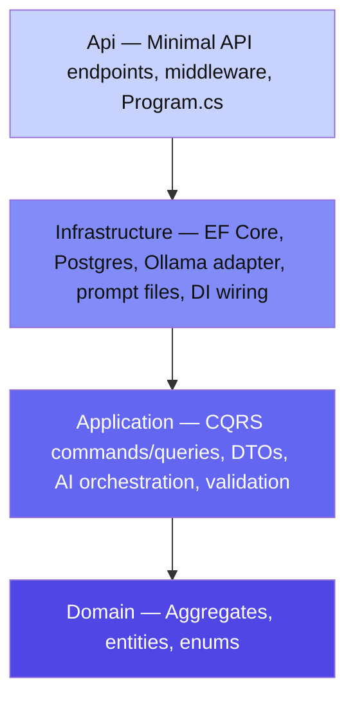
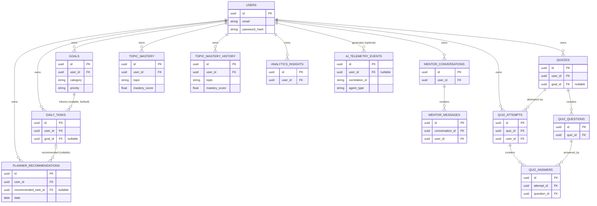
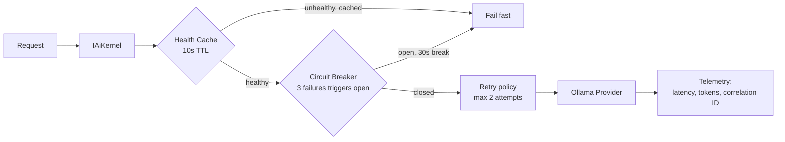

<div align="center">

# AI Study OS — Mentor

**A full-stack, AI-native study platform — goals, an energy-aware daily planner, an AI mentor
chat, an adaptive quiz engine, and real data-driven analytics — all routed through one shared,
provider-agnostic AI pipeline instead of scattered ad-hoc LLM calls.**

[](https://dotnet.microsoft.com/download)
[](https://nextjs.org)
[](https://react.dev)
[](https://www.postgresql.org)
[](https://ollama.com)
[](#clean-architecture)
[](#testing)
[%20complete-brightgreen)](#roadmap)

</div>

---

## Table of Contents

- [Overview](#overview)
- [Screenshots](#screenshots)
- [Demo](#demo)
- [Features](#features)
- [AI Pipeline](#ai-pipeline)
- [Clean Architecture](#clean-architecture)
- [Database](#database)
- [Project Structure](#project-structure)
- [AI Infrastructure](#ai-infrastructure)
- [Security](#security)
- [Testing](#testing)
- [API Overview](#api-overview)
- [Getting Started](#getting-started)
- [Performance](#performance)
- [Roadmap](#roadmap)
- [Contributing](#contributing)
- [License](#license)
- [Acknowledgements](#acknowledgements)

---

## Overview

AI Study OS is built with a **Clean Architecture / DDD backend** (ASP.NET Core 10) and a
**Next.js 16** frontend, running on a local, self-hosted AI stack ([Ollama](https://ollama.com) +
Llama 3.1) — no API keys, no per-token billing, no data leaving your machine.

Every AI-backed feature — planner recommendations, mentor chat, quiz generation, analytics
insights — flows through the same orchestration pipeline (agent registry → context builder →
prompt library → resilient kernel), not four different bespoke integrations.

**Status: Phase 1 (M0–M10) complete.** Every module below is real, tested, and runnable — no
mock data, no placeholder screens.

## Screenshots

> Screenshots to be added.

| Dashboard | Planner |
|---|---|
|  |  |

| Mentor | Quiz |
|---|---|
|  |  |

| Analytics |
|---|
|  |

## Demo

> Demo recording to be added.


The architecture, AI pipeline, and database diagrams referenced in the demo are not
placeholders — they're rendered live from this document in the sections below:
[Clean Architecture](#clean-architecture), [AI Pipeline](#ai-pipeline), [Database](#database).

## Features

| Module | Status | Highlights |
|---|:---:|---|
| **Auth** | ✅ | JWT access tokens, rotating & reuse-detecting refresh tokens, account lockout, IP rate limiting, security headers + HSTS |
| **Goals** | ✅ | Study goals by category, priority, and target date |
| **Planner** | ✅ | AI daily plan grounded in real goals/history, energy-aware sequencing, smart rescheduling, streaks, daily focus score, weekly workload balancing |
| **Mentor** | ✅ | Streaming AI chat, persisted conversations, intent-based routing to specialist agents (Tutor, Planner, Analytics, Examiner) |
| **Quiz** | ✅ | AI-generated MCQ / true-false / short-answer / fill-in-the-blank, auto-grading, weighted-moving-average topic mastery, weak-topic review quizzes |
| **Analytics** | ✅ | Server-computed metrics (study time, streaks, quiz trends, mastery evolution, planner effectiveness, AI usage), AI-generated weekly/monthly insights, PDF/CSV export |
| **Dashboard** | ✅ | Independently-loading widgets (today's plan, streak, goal progress, weak topics, mastery chart, weekly activity, AI insights) — one widget failing never blocks the rest |

## AI Pipeline

Every AI-backed feature — the planner recommendation, the mentor chat, quiz generation,
analytics insights — goes through the exact same pipeline. No feature calls a model provider
directly, and no feature owns its own bespoke prompt-building or JSON-parsing logic.



- **Agent Registry** — each specialist agent (Recommendation, Tutor, Planner-chat, Analytics,
  Examiner, Quiz Generator, Insights) declares its own prompt, context providers, output schema,
  and retry policy. Routing is data, not a switch statement full of prompts.
- **Context Builder** — assembles only the context an agent actually needs (goals, tasks,
  mastery, conversation history, memory) under a token budget, dropping lowest-priority fragments
  first.
- **IAiKernel** — the single component that ever talks to a provider adapter: shared JSON
  serialization, retry-with-repair on malformed output, circuit breaker, health caching, one
  identical code path for streaming and non-streaming, and per-request telemetry (latency,
  tokens, success/failure, correlation ID) persisted for every call.
- **Provider Adapter** — currently [Ollama](https://ollama.com) (`llama3.1`), so the whole app
  runs locally with zero API costs. `IAiChatClient` is the extension seam for a hosted provider
  (see [Roadmap](#roadmap)).

## Clean Architecture

Dependencies point inward, toward the Domain. Nothing in Domain or Application knows that
PostgreSQL, Ollama, or ASP.NET Core exist.



Every feature module (Goals, Planner, Mentor, Quiz, Analytics) follows the identical shape end to
end: a Domain aggregate → Application commands/queries → an EF configuration → a Minimal API
endpoint group → a typed frontend API client → a TanStack Query hook → a page. New features
extend this shape rather than inventing a new one.

## Database

PostgreSQL 16, EF Core migrations. Aggregates reference each other by **ID only** (no
cross-aggregate EF navigation properties), consistent with DDD aggregate-boundary isolation —
shown below as logical relationships.



## Project Structure

<details>
<summary><strong>Expand full repo layout</strong></summary>

```
backend/
  src/
    Domain/            Aggregates & entities — Goals, Planner, Mentor, Quiz, Analytics, Identity
                        No dependencies on anything else in the solution.
    Application/        CQRS handlers, DTOs, AI orchestration (agents, context, prompts, kernel)
                        Depends only on Domain.
    Infrastructure/     EF Core + Postgres, Ollama adapter, prompt templates, DI composition
                        Implements the interfaces Application defines.
    Api/                Minimal API endpoints, middleware, Program.cs
                        The only layer that knows about HTTP.
  tests/
    *.UnitTests/        Domain + Application unit tests
    *.IntegrationTests/ Real-Postgres (Testcontainers) + real-Ollama endpoint tests
frontend/
  app/                  Next.js App Router pages (route groups: (auth), (app))
  components/           UI, grouped by feature module
  lib/                  Typed API clients, TanStack Query hooks, types, stores
infra/                  docker-compose.yml (Postgres + Redis)
docs/                   Mentor persona source of truth, security audit notes
```

</details>

## AI Infrastructure

The AI pipeline (see [above](#ai-pipeline)) is backed by production-grade infrastructure, not a
single client call — every piece exists to make local-model inference reliable and observable.



| Component | Responsibility |
|---|---|
| **Agent Registry** | Declarative registration of every specialist agent — prompt, context providers, output schema, retry policy |
| **Context Builder** | Token-budgeted assembly of goals/tasks/mastery/history/memory, dropping lowest-priority fragments first |
| **Prompt Library** | Versioned prompt templates per agent, decoupled from orchestration code |
| **IAiKernel** | Single call surface for every provider interaction — retry, JSON repair, streaming |
| **Provider Adapter** (`IAiChatClient`) | `CompleteAsync`, `StreamAsync`, `PingAsync` — the seam a new provider implements |
| **Streaming** | `IAsyncEnumerable<string>` — the same code path serves streaming and non-streaming callers |
| **Retry** | Up to `MaxRetryAttempts` (default **2**) automatic retries on malformed/failed generations |
| **Circuit Breaker** | Opens after `CircuitBreakerFailureThreshold` (default **3**) consecutive failures, stays open for `CircuitBreakerBreakDurationSeconds` (default **30s**) |
| **Health Cache** | Provider liveness cached for `HealthCacheDurationSeconds` (default **10s**) — `PingAsync` never invokes the model itself, so checks are free and fast |
| **Telemetry** | Every call persists latency, token counts, success/failure, provider, model, and correlation ID to `ai_telemetry_events` |
| **Correlation IDs** | Threaded through every request for end-to-end tracing across the pipeline and logs |
| **Caching** | Analytics insights are cached rather than regenerated on every dashboard load |

`AiResilienceOptions` is validated at startup (`ValidateOnStart()`) — an invalid resilience
config fails the app immediately rather than surfacing as confusing runtime behavior later.

## Security

| Control | Implementation |
|---|---|
| **JWT access tokens** | Short-lived (`AccessTokenLifetimeMinutes`, default **15 min**), HS256-signed |
| **Refresh token rotation** | Every refresh issues a new token and invalidates the old one (`RefreshTokenLifetimeDays`, default **21 days**) |
| **Reuse detection** | A reused (already-rotated) refresh token revokes its entire token family — a signal of token theft |
| **Rate limiting** | `PermitLimit` requests (default **20**) per `WindowSeconds` (default **60s**) on auth endpoints |
| **Account lockout** | Locks after `MaxFailedAttempts` (default **5**) failed logins for `LockoutDurationMinutes` (default **15 min**) |
| **Security headers** | `X-Content-Type-Options`, `X-Frame-Options`, `Referrer-Policy` on every response |
| **HSTS** | Enabled outside local development |
| **Correlation IDs** | Every request traceable end to end through logs and AI telemetry |
| **Telemetry** | Auth events (login, lockout, refresh reuse) and AI calls are logged and persisted for audit |

Full audit trail and reasoning: [`docs/security/m1-auth-hardening.md`](docs/security/m1-auth-hardening.md).

## Testing

```bash
cd backend
dotnet test              # 182 tests across Domain, Application, Infrastructure, and Api.IntegrationTests
```

| Layer | Focus |
|---|---|
| `Domain.UnitTests` | Aggregate invariants, domain methods |
| `Application.UnitTests` | Command/query handler logic |
| `Infrastructure.UnitTests` | EF configurations, provider adapters |
| `Api.IntegrationTests` | Full HTTP pipeline against a real Postgres (Testcontainers) instance, plus real-Ollama tests for every AI-generation path (recommendation, mentor chat, quiz generation, insights) |

Integration tests are correctness tests against the actual pipeline, not mocks. A handful of
AI-dependent tests retry once to absorb the ordinary non-determinism of a small local model —
this never masks a real failure, only a single bad generation.

```bash
cd frontend
npx tsc --noEmit
npm run build
npm run lint
```

## API Overview

All routes are versioned under `/api/v1`, JWT-protected unless noted. Full request/response
contracts: Scalar docs at `/scalar` when the API is running.

<details>
<summary><strong>Auth</strong> — <code>/api/v1/auth</code></summary>

| Method | Route | Description |
|---|---|---|
| POST | `/register` | Create an account |
| POST | `/login` | Password login, issues access + refresh tokens |
| POST | `/refresh` | Rotate refresh token |
| POST | `/logout` | Revoke refresh token |
| GET | `/me` | Current user |

</details>

<details>
<summary><strong>Goals</strong> — <code>/api/v1/goals</code></summary>

| Method | Route | Description |
|---|---|---|
| GET | `/` | List goals (optional status filter) |
| POST | `/` | Create a goal |
| PUT | `/{id}` | Update a goal |
| DELETE | `/{id}` | Delete a goal |

</details>

<details>
<summary><strong>Planner</strong> — <code>/api/v1/planner</code></summary>

| Method | Route | Description |
|---|---|---|
| GET | `/today` | Today's plan |
| POST | `/recommendations/generate` | Generate an AI recommendation |
| POST | `/recommendations/stream` | Streaming recommendation generation |
| GET | `/week` | Week view |
| GET | `/recommendations/history` | Past recommendations |
| POST | `/tasks/reschedule-overdue` | Bulk-reschedule overdue tasks |
| PATCH | `/tasks/{id}/complete` | Mark a task complete |
| PATCH | `/tasks/{id}/skip` | Skip a task |
| PATCH | `/tasks/{id}/reschedule` | Reschedule a task |

</details>

<details>
<summary><strong>Mentor</strong> — <code>/api/v1/mentor</code></summary>

| Method | Route | Description |
|---|---|---|
| GET | `/conversations` | List conversations (search, pinned, paged) |
| POST | `/conversations` | Create a conversation |
| GET | `/conversations/{id}` | Get a conversation |
| PATCH | `/conversations/{id}/rename` | Rename |
| PATCH | `/conversations/{id}/pin` | Pin/unpin |
| DELETE | `/conversations/{id}` | Delete |
| GET | `/conversations/{id}/messages` | Paged message history |
| POST | `/conversations/{id}/messages` | Send a message |
| POST | `/conversations/{id}/messages/stream` | Streaming chat response |

</details>

<details>
<summary><strong>Quiz</strong> — <code>/api/v1/quiz</code></summary>

| Method | Route | Description |
|---|---|---|
| GET | `/` | List quizzes (paged) |
| POST | `/generate` | Generate a quiz |
| POST | `/generate/stream` | Streaming quiz generation |
| POST | `/submit` | Submit answers for grading |
| GET | `/history` | Attempt history |
| GET | `/attempts/{id}` | Attempt detail |
| GET | `/mastery` | Topic mastery |
| GET | `/weak-topics` | Weakest topics |
| GET | `/{id}` | Quiz detail |
| DELETE | `/{id}` | Delete a quiz |
| POST | `/{id}/retry` | Retry a quiz |

</details>

<details>
<summary><strong>Analytics</strong> — <code>/api/v1/analytics</code></summary>

| Method | Route | Description |
|---|---|---|
| GET | `/` | Metrics for a date range |
| GET | `/dashboard` | Dashboard snapshot |
| GET | `/weekly` | Weekly rollup |
| GET | `/monthly` | Monthly rollup |
| GET | `/streak` | Study streak |
| GET | `/goals` | Goal analytics |
| GET | `/quizzes` | Quiz analytics |
| GET | `/mastery` | Mastery analytics |
| GET | `/planner` | Planner effectiveness |
| GET | `/mentor` | Mentor usage |
| POST | `/insights/regenerate` | Regenerate AI insights |
| GET | `/export/pdf` | Export report as PDF |
| GET | `/export/csv` | Export report as CSV |

</details>

## Getting Started

**Prerequisites:** [.NET SDK 10](https://dotnet.microsoft.com/download),
[Node.js 20+](https://nodejs.org),
[Docker Desktop](https://www.docker.com/products/docker-desktop/), [Ollama](https://ollama.com).

```bash
# 1. Pull the model the app is configured to use
ollama pull llama3.1

# 2. Environment files
cp .env.example .env
cp frontend/.env.local.example frontend/.env.local

# 3. Postgres + Redis
docker compose -f infra/docker-compose.yml up -d

# 4. Backend — apply migrations, then run the API
cd backend
dotnet ef database update --project src/Infrastructure/AiStudyOS.Infrastructure --startup-project src/Api/AiStudyOS.Api
dotnet run --project src/Api/AiStudyOS.Api        # http://localhost:5246 — Scalar docs at /scalar

# 5. Frontend
cd ../frontend
npm install
npm run dev                                        # http://localhost:3000
```

Open `http://localhost:3000`, register an account, and everything — goals, planner, mentor,
quiz, analytics — is live against real Ollama generation from the first request.

## Performance

No synthetic benchmarks are published here — the runtime behaviors below are architectural,
not measured numbers:

- **Local inference** — every AI call runs against a local Ollama instance; latency is bound by
  local hardware, not network round-trips to a third-party API.
- **Streaming** — recommendation, mentor chat, and quiz generation all stream tokens as they're
  produced (`IAsyncEnumerable<string>` end to end) rather than blocking on a full completion.
- **Health cache** — provider liveness is cached for `HealthCacheDurationSeconds` (10s default),
  so health checks never invoke the model.
- **Circuit breaker** — after repeated provider failures, subsequent calls fail fast for
  `CircuitBreakerBreakDurationSeconds` (30s default) instead of queuing behind a struggling
  provider.
- **Cached insights** — analytics insights are persisted and reused rather than regenerated on
  every dashboard load.
- **Independent dashboard widgets** — each widget fetches and fails independently, so one slow
  or failing query never blocks the rest of the page.

## Roadmap

Planned, not yet built:

- [ ] Redis caching (already provisioned in `infra/docker-compose.yml`, not yet wired into the app)
- [ ] OpenAI provider adapter (via the existing `IAiChatClient` seam)
- [ ] Anthropic provider adapter (via the existing `IAiChatClient` seam)
- [ ] Gemini provider adapter (via the existing `IAiChatClient` seam)
- [ ] Docker deployment for the application itself (`infra/docker-compose.yml` currently covers only Postgres + Redis)
- [ ] Kubernetes deployment
- [ ] CI/CD pipeline
- [ ] Mobile app

## Contributing

This is currently a solo project in active development. Issues and pull requests are welcome —
please open an issue to discuss significant changes before submitting a PR.

## License

No license has been chosen yet. All rights reserved until a license is added.

## Acknowledgements

- [Ollama](https://ollama.com) and [Llama 3.1](https://ai.meta.com/llama/) for local inference
- [Mediator](https://github.com/martinothamar/Mediator) for in-process CQRS
- [shadcn/ui](https://ui.shadcn.com) (Base UI) and [Tailwind CSS](https://tailwindcss.com) for the frontend UI
- [QuestPDF](https://www.questpdf.com) for PDF report generation

---

<sub>Mentor persona and agent prompt source of truth: [`docs/Readme.md`](docs/Readme.md).</sub>
